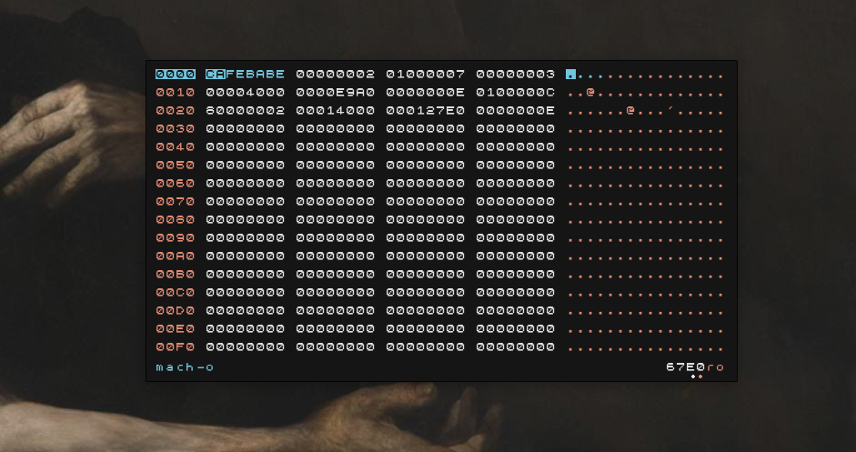

# hexing
Graphical and minimalistic hex editor. Comes with coloring of magic numbers to
aid in recognizing the type of file you are dealing with.


<p align="center">
  
</p>

Build
=====
Prerequisites are `SDL2` and `SDL2_TTF` libraries. To build the app just run:
```
$ gcc main.c -o hexing -lSDL2 -lSDL2_ttf -O3 -pedantic
```
You can optionally run `strip hexing` later to cut some bytes from the final
binary but won't do much difference.

Usage
=====
Mouse support was left behind as the usage is keyboard exclusive. Mouse is only
used for moving the window which can be done by pressing down the right mouse
button at any position of the window and dragging it.

Keys:
 * `UP/DOWN/PAGEUP/PAGEDOWN`: navigation through the file.
 * `g`: go to file offset. You can press `ENTER` if you don't want to write the
    full offset address.
 * `0-9a-f`: write byte to position in file.
 * `+/-`: add or substract to byte.
 * `x/X`: copy 1 or 4 escaped bytes from file.
 * `n`: write NOP (0x90) to position in file.
 * `ESC/q`: quit the application.

Customize
=========
The `theme` structure will let you customize the application by changing the
colors, font (TTF format) and font size. The font lives in `font.h` completely
and can be changed by just modifying the `ttf` and `ttf_len` variables.

TODO
====
 * Append new bytes to files.
 * Magic number with variable offsets (scan).

